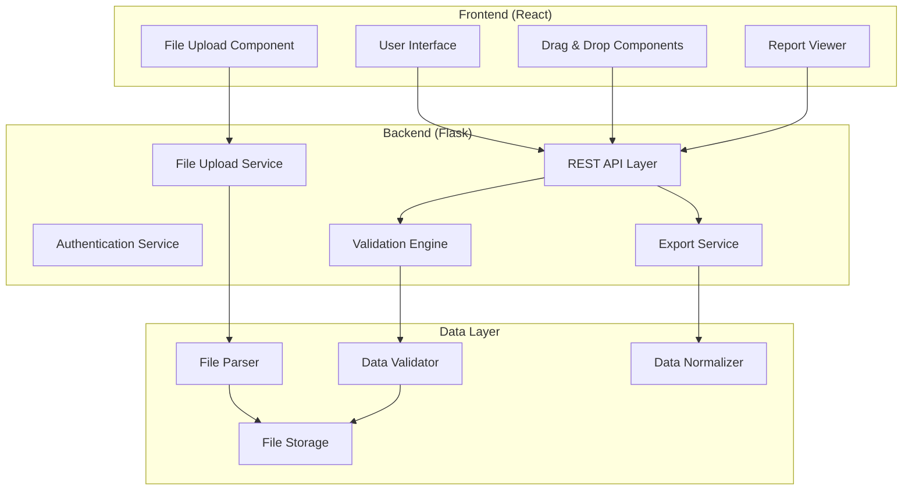

# Design Document

## Overview

El Validador de Instrumentos será una aplicación web construida con **Flask** (Python) como backend y **React** como frontend, proporcionando una interfaz moderna y responsiva para la validación de bases de datos de instrumentos educativos. La aplicación seguirá una arquitectura de microservicios ligera con separación clara entre la lógica de negocio, el procesamiento de datos y la presentación.

### Technology Stack Rationale

- **Backend: Flask + Python**: Elegido por su simplicidad, flexibilidad y excelente ecosistema para procesamiento de datos (pandas, openpyxl)
- **Frontend: React + TypeScript**: Para una interfaz moderna con drag-and-drop nativo y componentes reutilizables
- **Data Processing: Pandas + Openpyxl**: Para manejo eficiente de archivos Excel/CSV y análisis de datos
- **UI Framework: Material-UI**: Para componentes profesionales y consistentes
- **File Storage: Local filesystem**: Para simplicidad inicial, escalable a cloud storage

## Architecture



### Core Design Principles

1. **Separation of Concerns**: Cada componente tiene una responsabilidad específica
2. **Stateless Backend**: El backend no mantiene estado de sesión, facilitando escalabilidad
3. **Progressive Enhancement**: La aplicación funciona sin JavaScript, pero mejora con él
4. **Responsive Design**: Interfaz adaptable a diferentes tamaños de pantalla
5. **Error Resilience**: Manejo robusto de errores en cada capa

## Components and Interfaces

### Frontend Components

#### FileUploadComponent
```typescript
interface FileUploadProps {
  onFileSelected: (file: File, sheetName?: string) => void;
  acceptedFormats: string[];
  maxFileSize: number;
}

interface FileUploadState {
  selectedFile: File | null;
  availableSheets: string[];
  selectedSheet: string;
  uploadProgress: number;
  error: string | null;
}
```

#### VariableCategorizationComponent
```typescript
interface Variable {
  id: string;
  name: string;
  category: VariableCategory | null;
  sampleValues: string[];
}

interface CategorizationProps {
  variables: Variable[];
  onCategorization: (categorization: VariableCategorization) => void;
}

enum VariableCategory {
  INSTRUMENT = 'instrument',
  ITEM_ID = 'item_id', 
  METADATA = 'metadata',
  CLASSIFICATION = 'classification',
  OTHER = 'other'
}
```

#### ValidationReportComponent
```typescript
interface ValidationReport {
  summary: ValidationSummary;
  duplicateValidation: DuplicateValidationResult;
  metadataValidation: MetadataValidationResult;
  classificationValidation: ClassificationValidationResult;
  exportOptions: ExportOption[];
}

interface ValidationReportProps {
  report: ValidationReport;
  onExport: (format: string) => void;
}
```

### Backend Services

#### FileUploadService
```python
class FileUploadService:
    def upload_file(self, file: FileStorage) -> UploadResult
    def get_sheet_names(self, file_path: str) -> List[str]
    def parse_file(self, file_path: str, sheet_name: str = None) -> DataFrame
    def validate_file_format(self, file: FileStorage) -> bool
```

#### ValidationEngine
```python
class ValidationEngine:
    def __init__(self, data: DataFrame, categorization: VariableCategorization)
    
    def validate_duplicates(self) -> DuplicateValidationResult
    def validate_metadata_completeness(self) -> MetadataValidationResult  
    def analyze_classification_variables(self) -> ClassificationValidationResult
    def generate_comprehensive_report(self) -> ValidationReport
```

#### DataNormalizer
```python
class DataNormalizer:
    def normalize_column_names(self, data: DataFrame, categorization: VariableCategorization) -> DataFrame
    def create_mapping_sheet(self, original_names: List[str], normalized_names: List[str]) -> DataFrame
    def export_normalized_data(self, data: DataFrame, mapping: DataFrame) -> BytesIO
```

### REST API Endpoints

```python
# File Operations
POST /api/files/upload
GET /api/files/{file_id}/sheets
POST /api/files/{file_id}/parse

# Variable Categorization  
GET /api/files/{file_id}/variables
POST /api/files/{file_id}/categorization

# Validation
POST /api/validation/run
GET /api/validation/{validation_id}/report

# Export
POST /api/export/normalized
GET /api/export/{export_id}/download
```

## Data Models

### Core Data Structures

```python
@dataclass
class VariableCategorization:
    instrument_vars: List[str]
    item_id_vars: List[str] 
    metadata_vars: List[str]
    classification_vars: List[str]
    other_vars: List[str]

@dataclass
class ValidationResult:
    is_valid: bool
    errors: List[ValidationError]
    warnings: List[ValidationWarning]
    statistics: Dict[str, Any]

@dataclass
class DuplicateValidationResult(ValidationResult):
    duplicate_items: List[DuplicateItem]
    instruments_analyzed: int
    total_items_checked: int

@dataclass
class MetadataValidationResult(ValidationResult):
    missing_values: Dict[str, List[int]]  # variable -> row indices
    completeness_stats: Dict[str, float]  # variable -> completion percentage
    unique_values_summary: Dict[str, Set[str]]

@dataclass
class ClassificationValidationResult(ValidationResult):
    empty_cells: Dict[str, List[int]]  # variable -> row indices  
    unique_counts_per_instrument: Dict[str, Dict[str, int]]  # instrument -> {variable: count}
    completeness_stats: Dict[str, float]
```

### Database Schema (SQLite for simplicity)

```sql
-- File uploads tracking
CREATE TABLE uploads (
    id INTEGER PRIMARY KEY,
    filename VARCHAR(255),
    file_path VARCHAR(500),
    upload_timestamp DATETIME,
    file_size INTEGER,
    status VARCHAR(50)
);

-- Validation sessions
CREATE TABLE validation_sessions (
    id INTEGER PRIMARY KEY,
    upload_id INTEGER,
    categorization_json TEXT,
    validation_results_json TEXT,
    created_at DATETIME,
    FOREIGN KEY (upload_id) REFERENCES uploads(id)
);

-- Export history
CREATE TABLE exports (
    id INTEGER PRIMARY KEY,
    validation_session_id INTEGER,
    export_type VARCHAR(50),
    file_path VARCHAR(500),
    created_at DATETIME,
    FOREIGN KEY (validation_session_id) REFERENCES validation_sessions(id)
);
```

## Error Handling

### Error Categories

1. **File Upload Errors**
   - Invalid file format
   - File size exceeded
   - Corrupted files
   - Network interruptions

2. **Data Processing Errors**
   - Empty datasets
   - Invalid sheet selection
   - Encoding issues
   - Memory limitations

3. **Validation Errors**
   - Insufficient categorization
   - Data type mismatches
   - Logical inconsistencies

4. **Export Errors**
   - Disk space issues
   - Permission problems
   - Format conversion failures

### Error Handling Strategy

```python
class ValidationError(Exception):
    def __init__(self, message: str, error_code: str, severity: str):
        self.message = message
        self.error_code = error_code
        self.severity = severity  # 'error', 'warning', 'info'

class ErrorHandler:
    def handle_file_upload_error(self, error: Exception) -> ErrorResponse
    def handle_validation_error(self, error: ValidationError) -> ErrorResponse
    def handle_export_error(self, error: Exception) -> ErrorResponse
    def log_error(self, error: Exception, context: Dict[str, Any])
```

## Testing Strategy

### Unit Testing
- **Backend**: pytest para servicios de validación, parsers y normalizadores
- **Frontend**: Jest + React Testing Library para componentes
- **Data Processing**: Tests con datasets sintéticos y casos edge

### Integration Testing
- **API Testing**: Tests end-to-end de flujos completos
- **File Processing**: Tests con archivos reales de diferentes formatos
- **Drag & Drop**: Tests de interacción de usuario

### Performance Testing
- **Large File Handling**: Tests con archivos de 10MB+
- **Memory Usage**: Monitoreo de uso de memoria durante procesamiento
- **Response Times**: Benchmarks de tiempo de respuesta

### Test Data Strategy
```python
# Synthetic test datasets
def create_test_instrument_data(
    num_instruments: int = 3,
    items_per_instrument: int = 50,
    include_duplicates: bool = False,
    missing_metadata_rate: float = 0.0
) -> DataFrame
```

## Security Considerations

### File Upload Security
- Validación estricta de tipos de archivo
- Límites de tamaño de archivo
- Escaneo de contenido malicioso
- Almacenamiento temporal seguro

### Data Privacy
- No persistencia de datos sensibles
- Limpieza automática de archivos temporales
- Logs sin información personal
- Opción de procesamiento local

### Input Validation
- Sanitización de nombres de variables
- Validación de parámetros de API
- Protección contra inyección de código
- Rate limiting en endpoints

## Performance Optimization

### Backend Optimizations
- **Chunked Processing**: Procesamiento por lotes para archivos grandes
- **Lazy Loading**: Carga bajo demanda de datos
- **Caching**: Cache de resultados de validación
- **Async Processing**: Procesamiento asíncrono para operaciones pesadas

### Frontend Optimizations  
- **Virtual Scrolling**: Para listas grandes de variables
- **Debounced Interactions**: Para drag & drop fluido
- **Progressive Loading**: Carga incremental de reportes
- **Component Memoization**: Optimización de re-renders

### Memory Management
```python
class MemoryEfficientProcessor:
    def process_large_file(self, file_path: str, chunk_size: int = 10000):
        """Process large files in chunks to manage memory usage"""
        for chunk in pd.read_csv(file_path, chunksize=chunk_size):
            yield self.process_chunk(chunk)
```

## Deployment Architecture

### Development Environment
- **Local Development**: Flask dev server + React dev server
- **Database**: SQLite local
- **File Storage**: Local filesystem

### Production Environment  
- **Web Server**: Gunicorn + Nginx
- **Database**: PostgreSQL (escalable desde SQLite)
- **File Storage**: Local con opción a S3/Azure Blob
- **Monitoring**: Logging estructurado + health checks

### Scalability Considerations
- **Horizontal Scaling**: Stateless design permite múltiples instancias
- **Database Scaling**: Fácil migración a PostgreSQL
- **File Storage Scaling**: Abstracción permite migrar a cloud storage
- **Caching Layer**: Redis para cache distribuido si es necesario