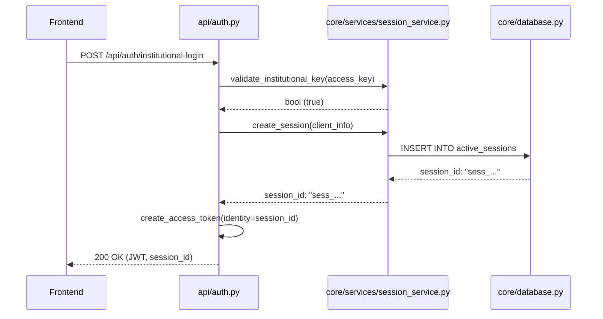
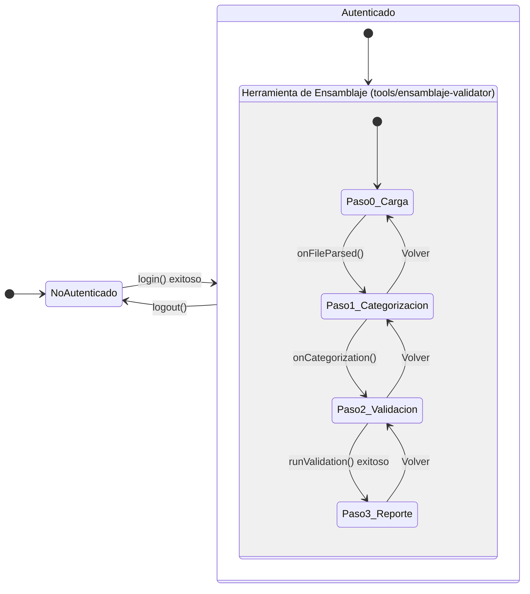

# Análisis Exhaustivo y Guía de Arquitectura: Validador de Instrumentos

**Versión del Documento:** 2.1
**Fecha:** 1 de septiembre de 2025

---

## 1. Introducción

### 1.1. Propósito del Documento

Este documento ofrece un análisis exhaustivo, técnico y funcional de la aplicación "Validador de Instrumentos". Su objetivo es servir como una guía central y completa para dos audiencias principales:

1.  **Stakeholders y Jefes de Proyecto:** Para que comprendan la arquitectura general, los flujos de trabajo, las capacidades y, fundamentalmente, las robustas garantías de seguridad de la aplicación. Se busca responder no solo al "qué hace", sino al "por qué se diseñó de esta manera".
2.  **Desarrolladores (Actuales y Futuros):** Para que entiendan la estructura del código, las tecnologías utilizadas, los patrones de diseño implementados y cómo mantener, refactorizar e implementar nuevas funcionalidades de manera eficiente, segura y coherente con la visión original del producto.

### 1.2. Resumen Ejecutivo (Visión No-Técnica)

El "Validador de Instrumentos" es una herramienta web segura diseñada para resolver un problema de negocio crítico: asegurar la calidad y consistencia de las bases de datos utilizadas en la evaluación de instrumentos educativos. 

En términos sencillos, la aplicación funciona como un asistente experto que guía a un usuario a través de un proceso de 4 pasos:

1.  **Carga:** El usuario sube su base de datos (un archivo Excel o CSV).
2.  **Categorización:** El usuario le "enseña" a la aplicación qué significa cada columna de su archivo (ej. "esta columna es el identificador del ítem", "esta otra es una variable de clasificación").
3.  **Validación:** Con esa información, la aplicación ejecuta un análisis automático y profundo, buscando errores comunes y críticos como ítems duplicados o información de metadata faltante.
4.  **Reporte y Exportación:** La aplicación presenta un reporte claro con los hallazgos y permite al usuario descargar tanto un informe en PDF como una versión corregida y estandarizada de su base de datos original.

El valor principal de esta herramienta es la **automatización de un proceso de control de calidad** que tradicionalmente es manual, tedioso y propenso a errores. Al estandarizar la validación, se asegura la integridad de los datos, lo que a su vez garantiza la fiabilidad de cualquier análisis o resultado que se derive de ellos. La aplicación fue construida con un enfoque primordial en la **seguridad y la privacidad**, asegurando que los datos del usuario estén aislados y se eliminen automáticamente después de un período de tiempo.

### 1.3. Glosario de Términos Clave

Para facilitar la lectura, a continuación se definen algunos conceptos técnicos recurrentes:

*   **API (Application Programming Interface):** Un conjunto de reglas y definiciones que permite que dos aplicaciones de software se comuniquen entre sí. En nuestro caso, es el puente entre el frontend (lo que el usuario ve) y el backend (donde ocurre la lógica).
*   **Backend:** La parte del sistema que se ejecuta en el servidor, invisible para el usuario. Es responsable de la lógica de negocio, la seguridad y la gestión de la base de datos.
*   **Base de Datos (SQLite):** Un sistema organizado para almacenar y gestionar datos. SQLite es una base de datos ligera que se almacena en un solo archivo, ideal para aplicaciones autocontenidas.
*   **CORS (Cross-Origin Resource Sharing):** Un mecanismo de seguridad del navegador que permite o deniega que una aplicación web (ej. `dominio-frontend.com`) solicite recursos a un dominio diferente (ej. `api.dominio-backend.com`).
*   **Framework:** Un conjunto de herramientas y librerías que proporciona una estructura base para construir una aplicación, permitiendo a los desarrolladores centrarse en la lógica específica de su proyecto. (Ej: Flask, React).
*   **Frontend:** La parte de la aplicación con la que el usuario interactúa directamente en su navegador. Es la interfaz de usuario (UI).
*   **JSON (JavaScript Object Notation):** Un formato de texto ligero para el intercambio de datos. Es el "idioma" que hablan el frontend y el backend para comunicarse a través de la API.
*   **JWT (JSON Web Token):** Un estándar compacto y seguro para transmitir información entre partes como un objeto JSON. Se utiliza aquí como una "credencial" digital que el frontend presenta al backend para demostrar que el usuario ha iniciado sesión y tiene permiso para acceder a los recursos.
*   **SPA (Single Page Application):** Una aplicación web que carga una única página HTML y luego actualiza dinámicamente el contenido a medida que el usuario interactúa con ella, sin necesidad de recargar la página. Esto proporciona una experiencia de usuario más fluida y rápida, similar a la de una aplicación de escritorio.
*   **Stack Tecnológico:** El conjunto de tecnologías, lenguajes y frameworks utilizados para construir una aplicación.

---

## 2. Arquitectura General de la Aplicación

El sistema está diseñado siguiendo una arquitectura de **Single Page Application (SPA)** con un backend desacoplado. Esta es una elección deliberada para separar las responsabilidades de la lógica de negocio (backend) y la presentación (frontend), lo que permite un desarrollo y mantenimiento más sencillos y escalables.

```mermaid
graph TD
    subgraph "Usuario"
        U[<fa:fa-user> Usuario]
    end

    subgraph "Frontend (Cliente en Navegador)"
        F[<fa:fa-react> Aplicación React / SPA]
    end

    subgraph "Backend (Servidor)"
        A[<fa:fa-server> API Server / Gunicorn]
        B[<fa:fa-flask> Capa API]
        C[<fa:fa-cogs> Capa Core (Servicios / Modelos)]
        T[<fa:fa-tools> Capa de Herramientas (Lógica de Negocio)]
        DB[(<fa:fa-file-alt> validador.db)]
    end

    subgraph "Almacenamiento Seguro"
        FS[<fa:fa-folder> Sistema de Archivos]
    end

    U -- "Interactúa con" --> F
    F -- "Llamadas a API (HTTPS/JSON)" --> A
    A -- "Pasa la petición" --> B
    B -- "Enruta a" --> T
    T -- "Usa" --> C
    C -- "Lee/Escribe en" --> DB
    C -- "Guarda/Lee Archivos de Usuario" --> FS
```

**Descripción del Flujo Arquitectónico:**

1.  El **Usuario** abre la aplicación en su navegador, cargando la **SPA de React**.
2.  Cada acción del usuario desencadena una llamada a la **API** del backend.
3.  Un servidor **Gunicorn** (en producción) gestiona las peticiones y las pasa a la aplicación **Flask**.
4.  La **Capa API** de Flask (`/api`) recibe la petición. Su responsabilidad es únicamente gestionar los detalles del protocolo HTTP, validar la autenticación y delegar la acción a la capa de negocio apropiada.
5.  Para la lógica de negocio, la capa API invoca a la **Capa de Herramientas (`/tools`)**. Esta capa es el verdadero cerebro de la aplicación, organizada como un sistema de "plugins". Cada subdirectorio es un "ToolKit" que encapsula la lógica para un tipo de validación específico.
6.  La **Capa de Herramientas** utiliza la **Capa Core (`/core`)** para acceder a funcionalidades compartidas y transversales, como la gestión de la base de datos o el procesamiento de archivos.
7.  La **Capa Core** es la única que interactúa directamente con la base de datos **SQLite** y el **Sistema de Archivos** del servidor, manteniendo una clara separación de responsabilidades.

Esta arquitectura por capas asegura una clara separación de responsabilidades, haciendo el sistema más modular y fácil de mantener.

---

## 3. Análisis Detallado del Backend (Python / Flask)

El backend es el responsable de la seguridad, la lógica de negocio y la persistencia de los datos.

### 3.1. Stack Tecnológico del Backend

| Librería | Propósito en Este Proyecto | ¿Por Qué se Eligió? (Justificación) |
| :--- | :--- | :--- |
| **Flask** | Framework web principal para construir la API. | **Simplicidad y Flexibilidad:** Ideal para construir una API a medida sin componentes innecesarios. |
| **Flask-JWT-Extended** | Gestión de JSON Web Tokens (JWT) para la autenticación. | **Estándar y Robusto:** La librería más popular y bien mantenida para JWT en Flask. |
| **Pandas** | **El motor de la lógica de negocio.** Manipulación y análisis de datos. | **El Estándar de Oro para la Ciencia de Datos en Python:** Potencia y flexibilidad inigualables para datos tabulares. |
| **ReportLab** | Generación de reportes en formato PDF. | **Madurez y Control:** Ofrece un control total sobre la apariencia del PDF generado. |
| **python-magic** | Detección de tipo de archivo por contenido (MIME type). | **Seguridad por Contenido, no por Nombre:** Previene la subida de archivos maliciosos renombrados. |
| **sqlite3** | Base de datos SQL embebida. | **Simplicidad y Portabilidad:** Hace la aplicación autocontenida y fácil de desplegar. |
| **schedule** | Programación de tareas periódicas. | **Simple y Ligero:** Perfecto para la tarea recurrente de borrar archivos viejos. |

### 3.2. Arquitectura y Flujos de Proceso del Backend

La arquitectura del backend está organizada en tres capas principales, cada una con una responsabilidad bien definida:

*   **`app/api` (Capa de API):** Es la puerta de entrada. Su única función es manejar las peticiones HTTP, validar la autenticación y los permisos, y pasar los datos a la capa de herramientas. No contiene lógica de negocio. El `tool_runner.py` es clave aquí, ya que actúa como un orquestador que puede ejecutar cualquier herramienta de forma genérica.
*   **`app/core` (Capa de Infraestructura Compartida):** Contiene toda la lógica y servicios que son comunes a cualquier herramienta. Esto incluye la conexión a la base de datos (`database.py`), los modelos de datos (`models.py`), y los servicios transversales como la subida segura de archivos (`file_service.py`), la gestión de sesiones (`session_service.py`) y la limpieza automática de datos (`cleanup_service.py`).
*   **`app/tools` (Capa de Lógica de Negocio):** Este es el cerebro de la aplicación. Cada subdirectorio aquí es un "plugin" o "ToolKit" que representa una lógica de validación específica. Actualmente, solo existe el `ensamblaje_tool`, que contiene todo lo necesario para la validación de instrumentos de ensamblaje: su propio `validator.py`, `exporter.py`, y sus `checks` específicos.

#### 3.2.1. Flujo de Autenticación y Sesión

**Concepto:** El sistema no autentica "usuarios" con contraseña, sino "clientes" con una clave institucional compartida. Una vez que un cliente demuestra tener la clave, se le otorga una sesión única y temporal para trabajar, asegurando que sus datos estén aislados de cualquier otra persona que use la aplicación al mismo tiempo.

**Detalle Técnico y Diagrama:**



**Ejemplo de Intercambio JSON:**

1.  **Petición del Frontend:**
    ```json
    POST /api/auth/institutional-login
    {
      "access_key": "clave-secreta-institucional"
    }
    ```

2.  **Respuesta del Backend (Exitosa):**
    ```json
    {
      "success": true,
      "access_token": "ey... (un token JWT muy largo) ...",
      "session_id": "sess_a1b2c3d4...",
      "expires_in": 86400,
      "message": "Sesión iniciada exitosamente"
    }
    ```

#### 3.2.2. Flujo Principal: Carga, Validación y Exportación

**Concepto:** Este es el corazón de la aplicación. Es un flujo guiado donde el usuario proporciona un archivo y el contexto necesario (la categorización de variables), y el sistema aplica la lógica de negocio para producir un análisis y resultados exportables.

**Detalle Técnico y Diagrama:**

```mermaid
graph TD
    subgraph "Paso 1 & 2: Carga y Categorización"
        A[Frontend envía archivo] --> B{api/files.py};
        B --> C{core/services/file_service.py};
        C --> D[Archivo guardado, registro en DB];
        D --> E[Frontend envía categorización];
        E --> F{api/files.py};
        F --> G{core/database.py: create_validation_session};
    end

    subgraph "Paso 3: Validación"
        H[Frontend solicita validación] --> I{api/tool_runner.py};
        I --> J{tools/__init__.py: get_toolkit('ensamblaje')};
        J --> K{tools/ensamblaje_tool/validator.py};
        K --> L[Ejecuta checks de duplicados, metadata, etc.];
        L --> M[Genera ValidationReport];
        M --> N{core/database.py: update_validation_results};
    end

    subgraph "Paso 4: Exportación"
        O[Frontend solicita exportación] --> P{api/tool_runner.py};
        P --> Q{tools/ensamblaje_tool/exporter.py};
        Q --> R[Crea archivo (Excel o PDF)];
        R --> S[Guarda archivo temporal, registro en DB];
        S --> T[Frontend descarga el archivo por ID];
    end

    A --> H;
    G --> H;
    N --> O;
```

**Ejemplo de Intercambio JSON (Pasos Clave):**

1.  **Petición de Categorización (final del Paso 2):**
    ```json
    POST /api/files/123/categorization
    {
      "instrument_vars": ["instrumento", "forma"],
      "item_id_vars": ["id_item"],
      "metadata_vars": ["clave", "invertido"],
      "classification_vars": ["competencia", "habilidad"],
      "other_vars": ["comentarios"]
    }
    ```

2.  **Respuesta del Backend:**
    ```json
    {
        "success": true,
        "upload_id": 123,
        "validation_session_id": 456,
        "message": "Categorización guardada exitosamente"
    }
    ```

3.  **Respuesta de la Validación (final del Paso 3):**
    ```json
    POST /api/tools/ensamblaje/run
    {
        "session_id": 456
    }
    
    // Respuesta:
    {
        "success": true,
        "validation_report": {
            "summary": { ... },
            "duplicate_validation": { ... },
            "metadata_validation": { ... },
            "classification_validation": { ... }
        },
        "session_id": 456
    }
    ```

### 3.3. Arquitectura de Seguridad Detallada

La seguridad es una característica de primer nivel en el diseño del backend.

*   **Aislamiento de Datos por Sesión:**
    *   **Qué es:** La base de datos está diseñada para que cada registro (`uploads`, `validation_sessions`, etc.) esté obligatoriamente ligado a un `session_id`. Es imposible a nivel de API acceder a datos de otra sesión.
    *   **Por qué es importante:** Garantiza la **privacidad y el aislamiento multi-tenant**. Aunque varios usuarios usen la aplicación simultáneamente, sus datos son completamente invisibles entre sí, como si cada uno tuviera su propia base de datos privada.

*   **Expiración Automática de Datos:**
    *   **Qué es:** Todos los datos y archivos subidos tienen una fecha de expiración (24 horas). Un proceso programado (`schedule`) se ejecuta periódicamente para borrar la información expirada.
    *   **Por qué es importante:** Cumple con el principio de **minimización de datos**. Reduce la superficie de ataque y el riesgo asociado al almacenamiento de datos a largo plazo. El servidor se mantiene limpio y se respeta la privacidad del usuario al no retener sus datos indefinidamente.

*   **Validación de Archivos en Profundidad:**
    *   **Qué es:** El `FileSecurityValidator` no confía en las extensiones de archivo. Analiza el contenido para detectar tipos de archivo reales (MIME types) y amenazas potenciales como macros.
    *   **Por qué es importante:** Previene una clase común de ataques donde un usuario malicioso renombra un archivo ejecutable (ej. `virus.exe` a `datos.xlsx`) para intentar eludir los filtros. Esta medida de seguridad bloquea dichos intentos.

*   **Cabeceras de Seguridad HTTP:**
    *   **Qué son:** La aplicación inyecta cabeceras en cada respuesta HTTP para dar instrucciones de seguridad al navegador del usuario.
    *   **Por qué son importantes:** Mitigan un amplio rango de ataques web. Por ejemplo:
        *   `Content-Security-Policy` (CSP): Define qué recursos (scripts, imágenes) tiene permitido cargar el navegador, previniendo ataques de Cross-Site Scripting (XSS).
        *   `Strict-Transport-Security` (HSTS): Fuerza al navegador a comunicarse siempre a través de HTTPS, evitando la degradación a HTTP inseguro.
        *   `X-Frame-Options`: Previene que la página sea cargada dentro de un `<iframe>` en otro sitio web, un ataque conocido como "clickjacking".

*   **Gestión de Secretos:**
    *   **Qué es:** Las claves sensibles (`SECRET_KEY`, `INSTITUTIONAL_ACCESS_KEY`) se gestionan a través de variables de entorno y nunca están escritas en el código.
    *   **Por qué es importante:** Previene la exposición accidental de credenciales si el código fuente se hace público. El sistema, además, tiene una autoverificación que impide que arranque en modo "producción" si detecta el uso de claves de desarrollo inseguras.

---

## 4. Análisis Detallado del Frontend (TypeScript / React)

El frontend es una aplicación React moderna, interactiva y bien estructurada, diseñada para guiar al usuario a través del proceso de validación.

### 4.1. Stack Tecnológico del Frontend

| Librería | Propósito en Este Proyecto | ¿Por Qué se Eligió? (Justificación) |
| :--- | :--- | :--- |
| **React** | Librería principal para construir la interfaz de usuario. | **Ecosistema y Madurez:** React es la librería de UI más popular del mundo, con un ecosistema inmenso de herramientas y componentes. |
| **TypeScript** | Añade tipado estático a JavaScript. | **Robustez y Mantenibilidad:** Previene una categoría entera de errores al verificar los tipos de datos durante la compilación. |
| **Material-UI (MUI)** | **Sistema de Diseño y Librería de Componentes.** | **Calidad y Velocidad:** MUI ofrece un conjunto completo de componentes de alta calidad que siguen los principios de Material Design. |
| **Axios** | Cliente HTTP para la comunicación con el backend. | **Sencillez y Potencia:** Su API intuitiva y los **interceptores** fueron cruciales para gestionar la autenticación de forma global. |
| **React DnD** | Librería para la funcionalidad de arrastrar y soltar. | **Flexibilidad y Potencia:** Es la librería de facto para implementar interacciones complejas de arrastrar y soltar en React. |
| **React Context API** | Mecanismo para la gestión de estado global. | **Nativo y Suficiente:** Para el único estado verdaderamente global (autenticación), el Context API de React es la herramienta perfecta. |

### 4.2. Arquitectura y Flujos de Proceso del Frontend

La arquitectura del frontend ha sido estructurada para ser modular y escalable, reflejando la filosofía del backend.

*   **`src/core`:** Contiene la lógica compartida y central, como el cliente de API (`api.ts`), el contexto de autenticación (`auth.tsx`) y los tipos de datos globales (`types.ts`). Esta es la infraestructura común del frontend.
*   **`src/pages`:** Define las vistas principales de la aplicación. `Login.tsx` para la autenticación y `Tool.tsx`, que actúa como un contenedor inteligente capaz de cargar y mostrar la herramienta de validación que el usuario seleccione.
*   **`src/tools`:** Es el análogo a la capa de herramientas del backend. Cada subdirectorio es una "mini-aplicación" de React que implementa la interfaz de usuario para una herramienta específica.
    *   **`ensamblaje-validator/index.tsx`:** Este es el orquestador de la herramienta. Funciona como una **máquina de estados finitos** que controla el flujo de pasos (Carga -> Categorización -> Reporte) y gestiona todo el estado relevante *únicamente para esta herramienta*.
    *   **`ensamblaje-validator/components/`:** Contiene todos los componentes de UI que son específicos para el validador de ensamblaje, como `FileUpload.tsx`, `VariableCategorization.tsx`, etc.

**Por qué este patrón es efectivo:**

*   **Modularidad y Aislamiento:** Cada herramienta es autocontenida. Se puede trabajar en el "Validador de Ensamblaje" sin afectar a otras futuras herramientas. El estado no se mezcla.
*   **Escalabilidad:** Añadir una nueva herramienta (ej. "Validador de Respuestas") es tan simple como crear un nuevo directorio en `src/tools/` e importarlo en `pages/Tool.tsx`, sin tocar el código existente.
*   **Separación de Responsabilidades:** `App.tsx` solo se preocupa del enrutamiento y el layout general. `pages/Tool.tsx` se preocupa de cargar la herramienta correcta. Y `tools/ensamblaje-validator/index.tsx` se preocupa de la lógica y el estado de esa herramienta en particular.



#### 4.2.2. Flujo de Usuario Detallado (UI/UX)

1.  **Login (`pages/Login.tsx`):** La puerta de entrada. Es una pantalla limpia y profesional que solicita la clave institucional.

2.  **Carga de Archivo (`tools/ensamblaje-validator/components/FileUpload.tsx`):** El primer paso del trabajo real. La zona de "arrastrar y soltar" es grande y da un claro feedback visual al usuario. La validación instantánea del lado del cliente y el diálogo para seleccionar la hoja de Excel son detalles de UX cruciales.

3.  **Categorización de Variables (`tools/ensamblaje-validator/components/VariableCategorization.tsx`):** La pantalla más compleja y el núcleo de la interacción del usuario. La metáfora de "arrastrar y soltar" es clara, y la UX defensiva (como el diálogo de "instrumento único") guía al usuario.

4.  **Reporte de Validación (`tools/ensamblaje-validator/components/ValidationReport.jsx`):** El resultado final. La información se presenta de forma digerible usando `Accordion`s, permitiendo una evaluación visual rápida del estado de la validación.

---

## 5. Conclusiones y Posibles Mejoras

### 5.1. Conclusiones

*   **Aplicación Robusta y Bien Diseñada:** El sistema sigue patrones de diseño modernos y buenas prácticas tanto en el backend (arquitectura por capas y plugins) como en el frontend (componentes modulares y estado aislado por herramienta).
*   **Seguridad como Pilar Central:** La seguridad no es un añadido, sino una parte fundamental de la arquitectura.
*   **Código Altamente Mantenible y Escalable:** La clara separación de responsabilidades y la arquitectura de plugins hacen que el código sea fácil de entender, mantener y, sobre todo, extender con nuevas funcionalidades o herramientas en el futuro.
*   **Experiencia de Usuario Guiada y Defensiva:** El frontend está diseñado para llevar al usuario de la mano a través de un proceso potencialmente complejo.

### 5.2. Posibles Mejoras y Refactorizaciones Futuras

*   **Cobertura de Pruebas (Testing):** El siguiente paso más importante sería **aumentar la cobertura de tests unitarios y de integración** para las capas `core` y `tools`.
*   **Gestión de Estado Avanzada en Frontend:** Si una herramienta individual se vuelve extremadamente compleja, podría beneficiarse de usar `useReducer` o Zustand internamente para gestionar su propio estado.
*   **Optimización de Base de Datos para Concurrencia:** Si la aplicación necesitara en el futuro soportar un alto volumen de usuarios simultáneos, migrar a un sistema cliente-servidor como **PostgreSQL** sería el siguiente paso lógico para la escalabilidad.
*   **Feedback de Progreso en Tiempo Real (WebSockets):** Implementar WebSockets o SSE para comunicar el progreso de validaciones largas mejoraría significativamente la experiencia de usuario.
*   **Tipado Completo en Frontend:** Completar las definiciones de tipos en `core/types.ts` para que coincidan con los modelos detallados del backend eliminaría el uso de `any` y aumentaría la seguridad del código TypeScript.